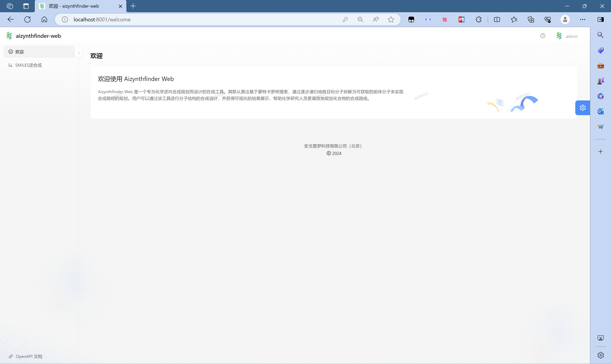
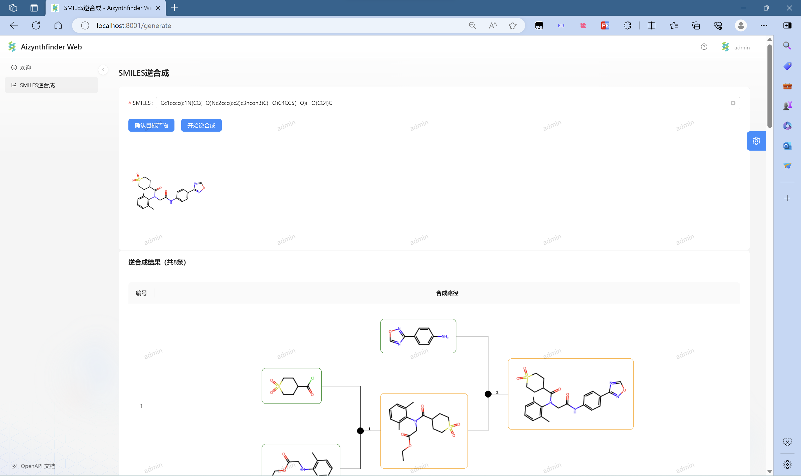
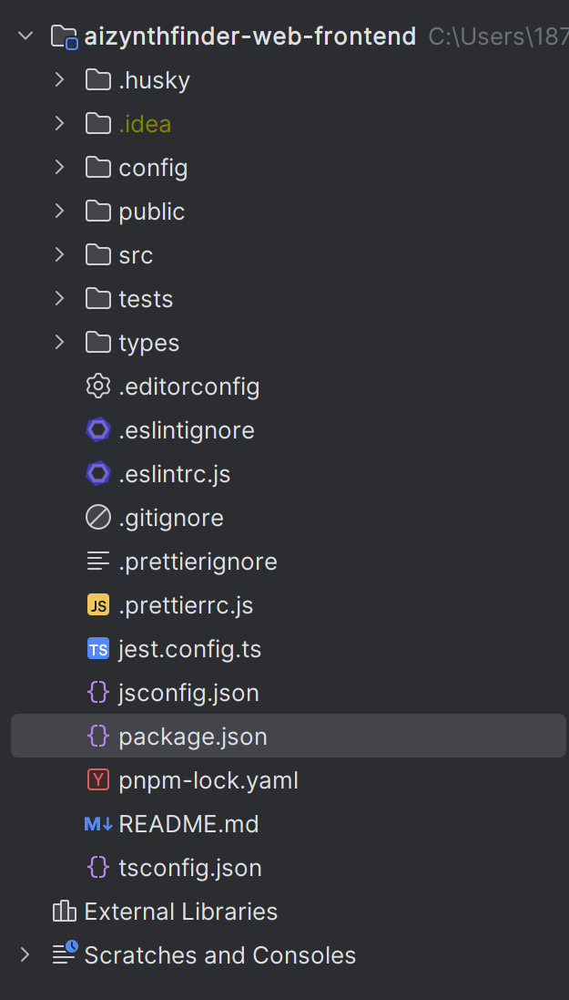
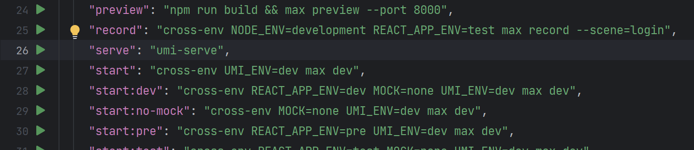
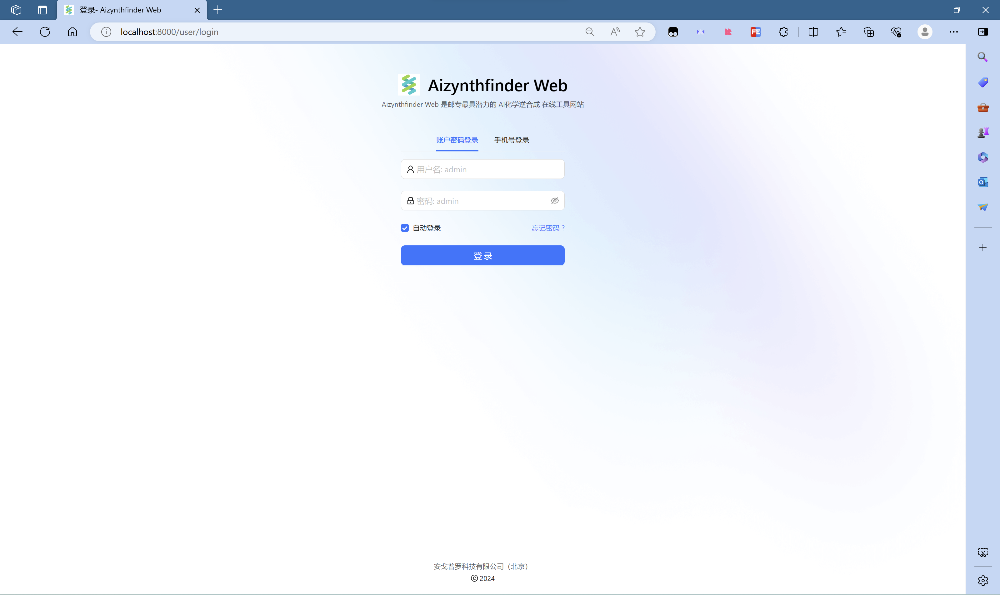

**注意事项：开发时请勿将new_aizynthfinder包整个提交至git，提交前请运行git status进行检查**

**注意事项：开发时请勿将new_aizynthfinder包整个提交至git，提交前请运行git status进行检查**

**注意事项：开发时请勿将new_aizynthfinder包整个提交至git，提交前请运行git status进行检查**


# aizynthfinder-web（开发中）

基于aizynthfinder化学逆合成算法包制作的web网站的前后端代码仓库


## 前端 - aizynthfinder-web-frontend

### 技术选型

- HTML + CSS + JavaScript 三件套
- React
- Ant Design组件库
- Umi
- Ant Design Pro 脚手架


### 基本页面

#### 用户登录页


#### 欢迎页



#### 逆合成分析页



## 后端 - aizynthfinder-web-backend

### 技术选型

- Python + Flask


## 快速开始

1. 将项目克隆至本地

```bash
git clone https://github.com/nx-xn2002/aizynthfinder-web.git
```
进入项目文件夹，创建名为`.git`的空文件夹，否则后面会报个错

2. 安装相关依赖

安装最新LTS版本的node.js以便运行前端项目 https://nodejs.org/en

在命令行更新当前npm至最新版本

3. 配置并启动前端项目

在idea、webstorm或pycharm等ide中，打开`aizynthfinder-web/aizynthfinder-web-frontend`文件夹，前端项目文件夹如图所示



在当前`aizynthfinder-web-frontend`目录下，命令行运行`npm install`指令安装依赖

运行完毕后，运行`package.json`文件中的`start`命令启动前端（或者执行命令`npm run start`）



启动成功可在浏览器看到以下页面



4. 配置并启动后端

在外部其他目录下，运行拉取后端依赖包

```bash
git clone https://github.com/chengfengke/new_aizynthfinder.git
```

然后在包目录下运行拉取大文件

```bash
git lfs pull
```

完成后，为避免项目中出现冲突，请将当前拉取到的`new_aizynthfinder`文件夹内的`.git`隐藏文件夹删除并重新创建一个名为`.git`的文件夹

严格完成以上步骤后，将当前文件夹拖入`aizynthfinder-web`文件夹中，然后在pycharm中打开`aizynthfinder-web/new_aizynthfinder`文件夹

5.后端环境配置

命令行运行指令初始化conda虚拟环境
```bash
conda create "python>=3.8,<3.10" -n aizynth-env
```

激活虚拟环境并安装相应依赖
```bash
conda activate aizynth-env
cd ./aizynthfinder-web-backend
pip install -r requirements.txt
```

在`aizynthfinder-web-backend/Config.py`文件中，修改`FRONT_END_PATH`的属性值，配置当前前端的路径，如：
```config
FRONT_END_PATH = r"E:\Projects\aizynthfinder-web\aizynthfinder-web-frontend"
```

修改`aizynthfinder-web/new_aizynthfinder/model_database/config_dev.yml`中的路径，可以使用`Ctrl+H`来批量替换为你本地真实的路径。

接下来，启动`new_aizynthfinder/aizynthfinder-web-backend/app.py`即可

6. 在浏览器中使用默认账号密码admin尝试进行登录，若成功，则前后端配置启动完毕


